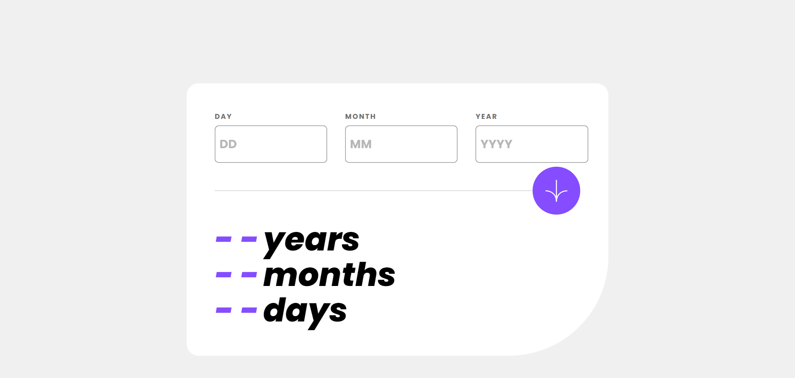
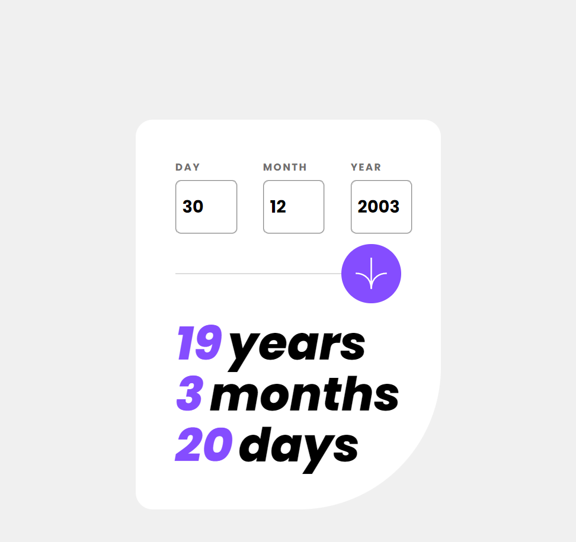
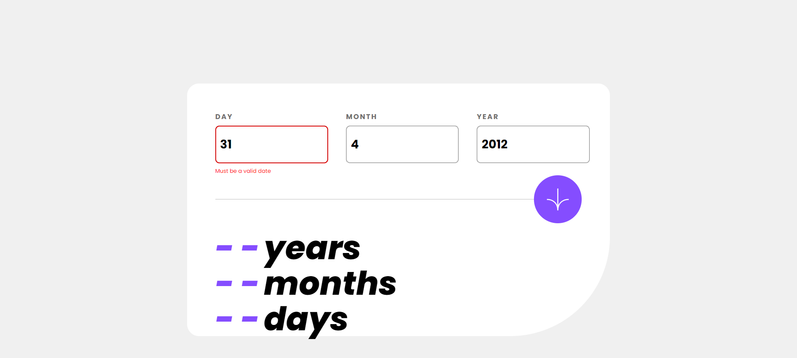
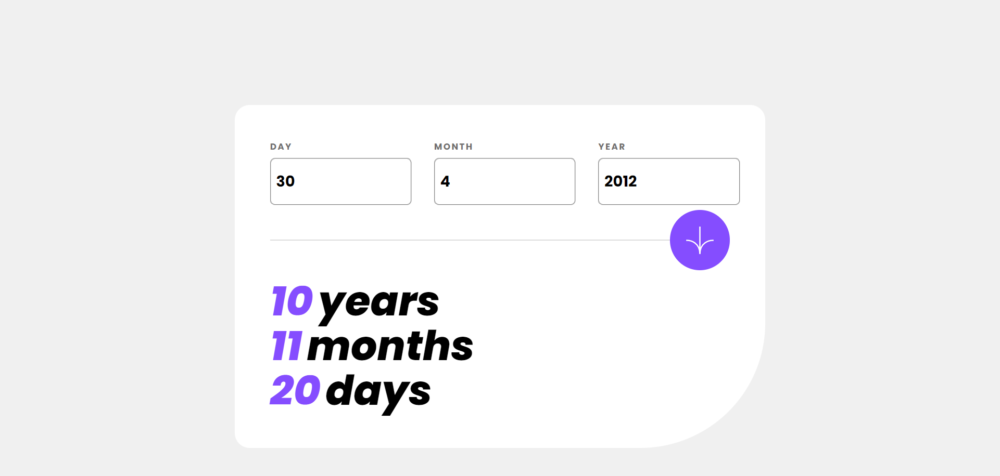
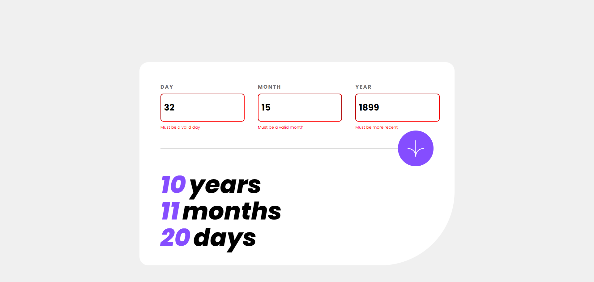
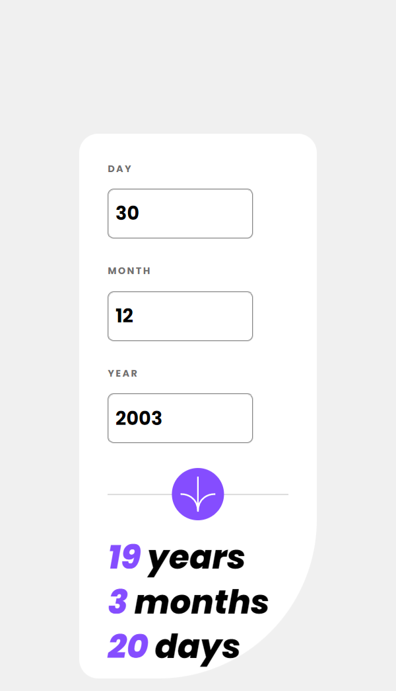

# Frontend Mentor - Age calculator app solution

This is a solution to the [Age calculator app challenge on Frontend Mentor](https://www.frontendmentor.io/challenges/age-calculator-app-dF9DFFpj-Q). Frontend Mentor challenges help you improve your coding skills by building realistic projects. 

## Table of contents

- [Overview](#overview)
  - [The challenge](#the-challenge)
  - [Screenshot](#screenshot)
  - [Links](#links)
- [My process](#my-process)
  - [Built with](#built-with)
- [Author](#author)

## Overview

### The challenge

Users should be able to:

- View an age in years, months, and days after submitting a valid date through the form
- Receive validation errors if:
  - Any field is empty when the form is submitted
  - The day number is not between 1-31
  - The month number is not between 1-12
  - The year is in the future
  - The date is invalid e.g. 31/04/1991 (there are 30 days in April)
- View the optimal layout for the interface depending on their device's screen size
- See hover and focus states for all interactive elements on the page
- **Bonus**: See the age numbers animate to their final number when the form is submitted

### Screenshot

| Desktop                                    | Mobile                                     |
| ------------------------------------------ | ------------------------------------------ |
|                                            |                                            |
|    |  |
|                                            |                                            |
|  |                                            |
|                                            |                                            |
|  |  |
|                                            |                                            |
|  |  |

### Links

- [Solution URL](https://github.com/ralucarizea/age-calculator-master/)
- [Live Site URL](https://age-calculator-master.vercel.app/)

## My process

### Built with

- [Create React App](https://github.com/facebook/create-react-app)
- CSS Flexbox
- CSS Grid
- [React](https://reactjs.org/) - JS library
- [React Hook Form](https://react-hook-form.com/) - Form Handling
- [Yup](https://github.com/jquense/yup) - Form Validation Library
- [Moment.js](https://momentjs.com/) - Handling Dates 
- [Duration Format Plugin](https://momentjs.com/docs/#/plugins/) - Plugin for handling dates

## Author

- Frontend Mentor - [@ralucarizea](https://www.frontendmentor.io/profile/ralucarizea)
- Twitter - [@raloocari](https://www.twitter.com/raloocari)

